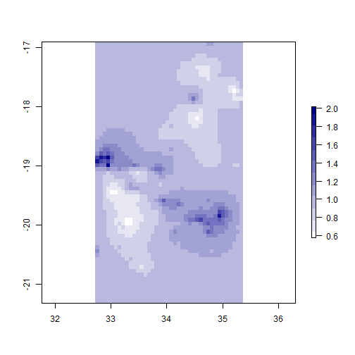

```r
#
# incomas_03_rti_prep_data.R
#
# Reed Sorensen
# August 2017
#
# Analysis of road traffic injuries from the INCOMAS study
# Preliminary regression results and geospatial analysis
# 
```


#### Model 1 - All ages
- Family: Poisson
- Outcome: Number of RTI among all ages
- Household predictors: urbanicity, having a car, having a motorcycle,
            SES index
- Other: Offset is number of people in the household
- 'ses\_index' uses all asset indicators except car and motorcycle 
(i.e. electricity, radio, tv, mobile phone, phone landline, refrigerator, 
watch, bicycle, cart and motorboat), 
because those are used as independent variables in the model. It is calculated
with _multiple correspondence analysis_. The method collapses all of the 
asset indicators into a single number while retaining as much information as possible.


```
## 
## Call:
## glm(formula = injmva_any ~ urban + has_car + has_motorcycle + 
##     ses_index + offset(log(householdn)), family = poisson(), 
##     data = df1)
## 
## Deviance Residuals: 
##     Min       1Q   Median       3Q      Max  
## -1.1247  -0.3725  -0.3138  -0.2511   4.0633  
## 
## Coefficients:
##                    Estimate Std. Error z value Pr(>|z|)    
## (Intercept)        -4.65041    0.10204 -45.575  < 2e-16 ***
## urbanTRUE          -0.44394    0.20507  -2.165   0.0304 *  
## has_carTRUE        -0.56449    0.42331  -1.334   0.1824    
## has_motorcycleTRUE  0.68558    0.16138   4.248 2.15e-05 ***
## ses_index           0.20805    0.08984   2.316   0.0206 *  
## ---
## Signif. codes:  0 '***' 0.001 '**' 0.01 '*' 0.05 '.' 0.1 ' ' 1
## 
## (Dispersion parameter for poisson family taken to be 1)
## 
##     Null deviance: 1100.0  on 3025  degrees of freedom
## Residual deviance: 1067.5  on 3021  degrees of freedom
##   (12 observations deleted due to missingness)
## AIC: 1444.1
## 
## Number of Fisher Scoring iterations: 6
```

#### Model 2 - Children only
- Family: Poisson
- Outcome: Number of RTI among children
- Household predictors: urbanicity, having a car, having a motorcycle,
            SES index
- Other: Offset is number of children in the household


```
## 
## Call:
## glm(formula = injmva_children ~ urban + has_car + has_motorcycle + 
##     ses_index + offset(log(n_kids)), family = poisson(), data = df2)
## 
## Deviance Residuals: 
##     Min       1Q   Median       3Q      Max  
## -0.4590  -0.1952  -0.1571  -0.1249   4.5559  
## 
## Coefficients:
##                    Estimate Std. Error z value Pr(>|z|)    
## (Intercept)        -5.45920    0.21576 -25.302   <2e-16 ***
## urbanTRUE          -0.45796    0.47449  -0.965    0.334    
## has_carTRUE        -0.52026    1.03066  -0.505    0.614    
## has_motorcycleTRUE  0.49021    0.35781   1.370    0.171    
## ses_index           0.05344    0.20697   0.258    0.796    
## ---
## Signif. codes:  0 '***' 0.001 '**' 0.01 '*' 0.05 '.' 0.1 ' ' 1
## 
## (Dispersion parameter for poisson family taken to be 1)
## 
##     Null deviance: 355.33  on 2845  degrees of freedom
## Residual deviance: 351.70  on 2841  degrees of freedom
##   (10 observations deleted due to missingness)
## AIC: 441.54
## 
## Number of Fisher Scoring iterations: 7
```

#### Model 3 - Adults only
- Family: Poisson
- Outcome: Number of RTI among adults
- Household predictors: urbanicity, having a car, having a motorcycle,
            SES index
- Other: Offset is number of adults in the household


```
## 
## Call:
## glm(formula = injmva_adults ~ urban + has_car + has_motorcycle + 
##     ses_index + offset(log(n_adults)), family = poisson(), data = df3)
## 
## Deviance Residuals: 
##     Min       1Q   Median       3Q      Max  
## -1.0393  -0.3377  -0.2564  -0.2368   4.0661  
## 
## Coefficients:
##                    Estimate Std. Error z value Pr(>|z|)    
## (Intercept)        -4.09222    0.11265 -36.327  < 2e-16 ***
## urbanTRUE          -0.55045    0.22607  -2.435 0.014897 *  
## has_carTRUE        -0.63275    0.46471  -1.362 0.173318    
## has_motorcycleTRUE  0.66735    0.18112   3.685 0.000229 ***
## ses_index           0.23035    0.09899   2.327 0.019970 *  
## ---
## Signif. codes:  0 '***' 0.001 '**' 0.01 '*' 0.05 '.' 0.1 ' ' 1
## 
## (Dispersion parameter for poisson family taken to be 1)
## 
##     Null deviance: 960.85  on 3008  degrees of freedom
## Residual deviance: 931.91  on 3004  degrees of freedom
##   (12 observations deleted due to missingness)
## AIC: 1239.2
## 
## Number of Fisher Scoring iterations: 6
```

#### Model 4 - Vehicles as single categorical variable
- Family: Poisson
- Outcome: Number of RTI among adults
- Household predictors: urbanicity, 
  categorical vehicle variable (see below), SES index
- Other: Offset is number of adults in the household  
</br>
Vehicle variable:
- 1. No car or motorcycle (reference group)
- 2. Motorcycle only
- 3. Car only
- 4. Car and motorcycle


```
## 
## Call:
## glm(formula = injmva_adults ~ urban + vehicles2 + ses_index, 
##     family = poisson(), data = df3)
## 
## Deviance Residuals: 
##     Min       1Q   Median       3Q      Max  
## -0.6183  -0.2922  -0.2867  -0.2819   4.2699  
## 
## Coefficients:
##                    Estimate Std. Error z value Pr(>|z|)    
## (Intercept)        -3.01038    0.11403 -26.399  < 2e-16 ***
## urbanTRUE          -0.65917    0.22625  -2.913  0.00357 ** 
## vehicles2Moto only  0.84396    0.18312   4.609 4.05e-06 ***
## vehicles2Car only   0.11284    0.52361   0.216  0.82937    
## vehicles2Both      -0.72597    1.01246  -0.717  0.47335    
## ses_index           0.27883    0.09897   2.817  0.00484 ** 
## ---
## Signif. codes:  0 '***' 0.001 '**' 0.01 '*' 0.05 '.' 0.1 ' ' 1
## 
## (Dispersion parameter for poisson family taken to be 1)
## 
##     Null deviance: 945.44  on 3008  degrees of freedom
## Residual deviance: 902.93  on 3003  degrees of freedom
##   (12 observations deleted due to missingness)
## AIC: 1212.2
## 
## Number of Fisher Scoring iterations: 6
```

#### Model 5 - using spatial coordinates a predictor


Map shows incidence rate ratio (IRR) for each pixel
- Darkers areas are over Beira and Chimoio  
  
**[Click here](https://drive.google.com/open?id=1F5nMjt8ExAg0UiTRu8LCvDKIZtw&usp=sharing)** to see this location on a Google map



**Spatial regression results:**  
Note: 'hi' and 'lo' indicate the upper and lower bounds for 
the Bayesian credible interval (not a confidence interval)


```
##                            mean          lo         hi
## (Intercept)        -4.223340439 -4.59343280 -3.8646261
## urbanTRUE          -0.558215433 -1.14259974  0.0243510
## vehicles2Moto only  0.751742401  0.37628613  1.1187396
## vehicles2Car only  -0.004034718 -1.13342393  0.9352659
## vehicles2Both      -0.966662554 -3.22975051  0.7404608
## ses_index           0.174727076 -0.03949183  0.3838563
```

